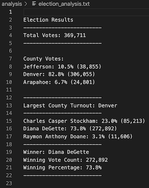

# Election_Analysis

## Overview
To complete the election audit of a recent local congressional election in Colorado, the election commission has asked for the following information:

1. Calculate the total number of votes of cast.
2. The voter turnout for each county.
3. The percentage of votes from each county out of total count.
4. The county with the highest turnout
5. Get a complete list of candidates who recieved votes.
6. Calculate the total number of votes each candidate recieved.
7. Calculate the percentage of votes each candidatae won.
8. Determine the winnner of the election based on popular vote.

## Resources
- Data Source: election_results.csv
- Software: Python 3.7.6, Visual Studio Code 1.56.0

## Election-Audit Results
The result of the script is show below:



The analysis of the election results show that:
* There were 369,711 total votes cast in this congressional election

### Counties Analysis
* Breakdown of the votes and percentage of total votes in each county
  * Jefferson received 10.5% of the vote and 38,855 number of votes.
  * Denver recieved 82.8% of the vote and 306,055 number of votes.
  * Arapahoe recieved 6.7% of the vote and 24,801 number of votes.
* Denver had the highest vote count.

### Candidate Analysis
* Breakdown of the votes and percentage of total votes for each candidate
  * Charles Casper Stockham received 23.0% of the vote and 85,213 number of votes.
  * Diana DeGette recieved 73.8% of the vote and 272,892 number of votes.
  * Raymon Anthony Doane recieved 3.1% of the vote and 11,606 number of votes.
* The winner of the election was:
  * Diana Degette, who recieved 73.8% of the vote and 272,892 number of votes.


## Election-Audit Summary
This script was used to audit a local congressional election in Colorado. However, this script can be re-used for any other elections provided that the input file (Resources/election_analysis.csv) has the same structure and type of data. The following sections explore how we can do this by slightly modifying the script:

### Modification 1 - Add user prompt for Input File
This script currently takes input from one file. In order to audit another election, this file must be overwritten with data from the other election. 
If the input data must be saved for later use / re-run again, one can prompt the user for a file name to read.
The following code can be modified here:
```
# Add a variable to load a file from a path.
file_name_to_read = input("Enter the name of the file to be read, including extension:")
file_to_load = os.path.join("Resources", file_name_to_read)
```
We replace the hardcoded "election_results.csv" with the input from the user. This would be useful in the event of multiple elections that need to be audited.
Further modification to make this more user friendly could be made by automatically reading through all csv files in the Resources folder.

### Modification 2 - Modify output file to match name of input file.
Thie script currently outputs to one file. This file is constantly being overwritten at the end of the script. In order to make this script more user friendly, we could automatically change the output file name based on the input. Used in conjunction with Modification 1 above, the code block would be the following:
```
# Split input file name to remove .csv at the end of filename
split_file_name = file_name_to_read.split(".")
# Add a variable to save the file to a path.
file_to_save = os.path.join("analysis", split_file_name[0]+"_analysis.txt")
```
The hardcoded "election_analysis.txt"is replaced in favour of a variable, which changes based on input file name. 
